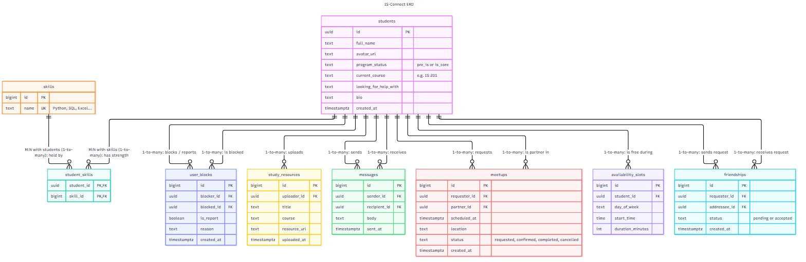

# IS-Connect

A web app that helps pre-IS students find classmates to study with, ask for help, and feel like they belong in the Information Systems program.

**Team:** Reece Bunnage · Josh Graham · Abby Cook · Jeremiah Gallardo

## App Summary

Many pre-IS students want to join the Information Systems program but feel less technical than their peers. They are busy and nervous to ask strangers for help, so they end up studying alone and some give up on applying. IS-Connect gives these students a low-pressure way to find someone in a similar situation. A student creates a short profile that says whether they are Pre-IS or in the IS Core, which course they are taking, what they need help with, and what their strengths are (Python, SQL, Excel, etc.). Other students can browse and filter those profiles in **Find Friends** to find a study partner who can help with exactly what they are stuck on. The app also has screens for messages, scheduling meetups, shared study guides, a daily IS tip, and blocking/reporting. In this milestone, **Create profile** saves to a real Postgres database, and the Messages, My Meetups, and Study Resources screens read live sample data from that database.

## ERD



Source files: [docs/erd.mmd](docs/erd.mmd) (Mermaid) and [docs/erd.dbml](docs/erd.dbml) (paste into [dbdiagram.io](https://dbdiagram.io) to edit).

| Entity | What it stores |
|---|---|
| `students` | A person using the app: name, Pre-IS or IS Core, current course, what they need help with |
| `skills` | An IS strength a student can list, such as Python or SQL |
| `student_skills` | Join table linking students to their strengths |
| `friendships` | A friend request between two students, and whether it was accepted |
| `messages` | A one-on-one chat message from one student to another |
| `availability_slots` | A weekly time a student is free to study |
| `meetups` | A study session between two students: when, where, and its status |
| `study_resources` | A study guide or file a student shared |
| `user_blocks` | A block or report of one student by another |

**Relationships**
- `students` **one-to-many** `availability_slots`: a student can list many free times.
- `students` **one-to-many** `study_resources`: a student can upload many study guides.
- `students` **many-to-many** `skills`, through `student_skills`: a student has many strengths, and a strength belongs to many students.
- `students` **many-to-many** `students`, through `friendships`, `messages`, `meetups`, and `user_blocks`: each of these tables has two foreign keys to `students` (for example, sender and recipient). From the `students` side, each link is one-to-many.

## Tech Stack

| Layer | What we used |
|---|---|
| Frontend | React 19 + Vite (HTML/CSS/JavaScript) |
| Backend / API | [Supabase](https://supabase.com), backend as a service. It generates a REST API from our tables, and we call it with the `@supabase/supabase-js` client. |
| Database | PostgreSQL, hosted by Supabase, with Row Level Security policies |
| Secrets | The Supabase URL and publishable key live in `.env.local`, which is listed in `.gitignore` |

**Why this fits our team:** Supabase's free tier gives us a real PostgreSQL database without running or hosting our own server. Every teammate can see the tables and rows in the Supabase dashboard, and we can still write the schema ourselves in SQL ([supabase/schema.sql](supabase/schema.sql)). The whole team shares one project, so our setups can't drift apart. React + Vite is a small, fast setup that works well on phones, which matters because our persona would mostly use IS-Connect on their phone.

## How to Get It Running

**Just want to use it?** The live site is at https://reece-bunnage.github.io/IS-Connect/. No install needed.

To run it on your own computer, you need [Node.js](https://nodejs.org) 22 or newer and [Git](https://git-scm.com).

1. **Get the code**
   ```bash
   git clone https://github.com/Reece-Bunnage/IS-Connect.git
   cd IS-Connect
   npm install
   ```
2. **Set up the database** (skip if you are using the team's existing Supabase project)
   1. Create a free project at [supabase.com](https://supabase.com).
   2. Do step 3 below first, then add one more line to `.env.local`: `SUPABASE_DB_URL=` followed by the URI from **Connect → Session pooler**, with your database password in place of `[YOUR-PASSWORD]`.
   3. Run `npm run db:setup`. This creates the 9 tables and their access policies and adds sample rows. It refuses to run if the tables already exist; `npm run db:setup -- --reset` wipes **all data** and rebuilds.

   (No terminal? Paste [supabase/schema.sql](supabase/schema.sql) and then [supabase/seed.sql](supabase/seed.sql) into **SQL Editor → New query** and click **Run** for each.)
3. **Add your keys**
   1. In Supabase, click **Connect** (or go to **Project Settings → API**) and copy the **Project URL** and the **publishable / anon** key. Never use the `service_role` / secret key.
   2. Copy `.env.example` to a new file named `.env.local`, and paste in the two values:
      ```
      VITE_SUPABASE_URL=https://your-project-ref.supabase.co
      VITE_SUPABASE_ANON_KEY=sb_publishable_...
      ```
4. **Start the app**
   ```bash
   npm run dev
   ```
   Open the `http://localhost:5173` link that it prints.

### Deploying

Every push to `main` rebuilds the live site through [.github/workflows/deploy.yml](.github/workflows/deploy.yml). One-time setup on GitHub:

1. **Settings → Secrets and variables → Actions → New repository secret**: add `VITE_SUPABASE_URL` and `VITE_SUPABASE_ANON_KEY` (same values as `.env.local`).
2. **Settings → Pages → Build and deployment → Source**: choose **GitHub Actions**.
3. **Actions → Deploy to GitHub Pages → Run workflow** (or just push to `main`).

## Verifying the Vertical Slice

The working button is **Create profile**. It inserts a new row into the `students` table (and any selected strengths into `student_skills`).

1. On the home screen, click **Make Account**, or the **Create your profile →** button.
2. Fill in a name, choose **Pre-IS** or **IS Core**, add a course such as `IS 201`, and pick one or two strengths.
3. Click **Create profile**. The app sends an insert request to Supabase. The database saves the row and returns it, and the page shows **"Welcome, {your name}!"** with the program, course, and new student ID from that returned row.
4. Click **See yourself in Find Friends →**. Your new profile is at the top of the list, with your strengths.
5. **Refresh the page** (F5 / Ctrl+R). The app reopens on Find Friends, and your profile is still there, because it is loaded from the database.
6. Optional: in the Supabase dashboard, open **Table Editor → students** to see the new row.
